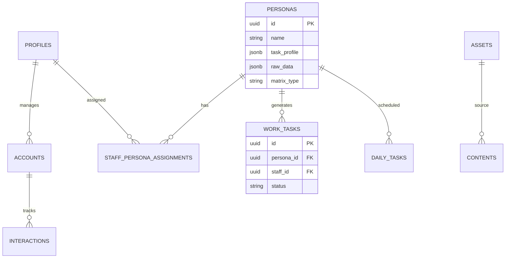

# 資料庫健康檢查與功能完整性報告
日期：2026-01-20

## 1. 資料庫層面檢查 (Database Level)

### 1.1 資料表結構驗證
經檢查，所有核心資料表皆已建立且結構符合業務需求：

| 資料表名稱 | 說明 | 狀態 | 備註 |
|:--- |:--- |:--- |:--- |
| **personas** | AI 人設核心表 | ✅ 正常 | 已包含 `raw_data`, `matrix_type` 等新欄位 |
| **accounts** | 社群帳號表 | ✅ 正常 | 包含平台枚舉約束 (`instagram`, `threads`...) |
| **assets** | 素材資產表 | ✅ 正常 | 包含分類與風險等級欄位 |
| **work_tasks** | 工作任務表 | ✅ 正常 | 關聯至人設、帳號與員工 |
| **daily_tasks** | 每日排程表 | ✅ 正常 | 用於生成內容的排程 |
| **staff_persona_assignments** | 員工分配表 | ✅ 正常 | 記錄人設與員工的綁定關係 |
| **profiles** | 用戶檔案表 | ✅ 正常 | 與 Supabase Auth 連動 |

### 1.2 欄位與約束檢查
- **主鍵 (Primary Keys)**: 所有表皆使用 `UUID` 作為主鍵，且預設值為 `gen_random_uuid()`，符合最佳實踐。
- **外鍵 (Foreign Keys)**: 
  - `work_tasks` 正確關聯至 `personas(id)`, `accounts(id)`, `profiles(id)`。
  - `staff_persona_assignments` 正確關聯至 `profiles(id)` 與 `personas(id)`。
- **數據類型**: 
  - `jsonb` 正確用於 `task_profile`, `knowledge_base` 等非結構化數據。
  - `text[]` 正確用於標籤類數據。

### 1.3 索引效能分析 (潛在風險)
⚠️ **發現問題**: Supabase (PostgreSQL) 不會自動為外鍵建立索引。
- **風險**: 當資料量增長時，查詢「某人設的所有任務」或「某員工的所有分配」將導致全表掃描 (Full Table Scan)，效能會顯著下降。
- **建議新增索引**:
  - `work_tasks(persona_id)`
  - `work_tasks(staff_id)`
  - `work_tasks(account_id)`
  - `daily_tasks(persona_id)`
  - `daily_tasks(task_date)` (用於日期範圍查詢)

---

## 2. 功能對應檢查 (Functional Check)

### 2.1 CRUD 與 交易完整性 (Transactions)
⚠️ **發現問題**: API 層面的刪除操作不具備原子性 (Atomicity)。
- **位置**: `api/routes/personas.ts` 的 DELETE 操作。
- **現狀**: 
  1. 刪除 task_templates (await)
  2. 刪除 daily_tasks (await)
  3. 刪除 personas (await)
- **風險**: 若第 2 步失敗，第 1 步的資料已被刪除且無法自動回滾 (Rollback)，導致資料不一致。
- **建議**: 使用 Supabase RPC (Stored Procedure) 將多表刪除封裝在單一資料庫交易中。

### 2.2 並發操作 (Concurrency)
- **現狀**: 無明確的樂觀鎖 (Optimistic Locking) 機制 (如 `version` 欄位)。
- **風險**: 若兩個管理員同時編輯同一個人設，後提交者會覆蓋前者的修改。
- **緩解**: 目前 API 採用 `PUT` 更新特定欄位，且前端介面為單人操作為主，風險尚可接受，但建議未來新增 `version` 欄位。

---

## 3. 效能與安全檢查 (Performance & Security)

### 3.1 Row Level Security (RLS) 安全性
🔴 **嚴重風險**: 部分核心資料表未啟用 RLS。

| 資料表 | RLS 狀態 | 風險等級 | 建議 |
|:--- |:--- |:--- |:--- |
| **personas** | ❌ Disabled | High | 應啟用 RLS，僅允許授權角色讀寫 |
| **work_tasks** | ❌ Disabled | High | 應啟用 RLS，限制僅能看見分配給自己的任務 |
| **daily_tasks** | ❌ Disabled | Medium | 建議啟用 |
| **system_logs** | ❌ Disabled | Medium | 建議啟用，僅 Admin 可讀 |
| **accounts** | ✅ Enabled | Low | 保持現狀 |

### 3.2 SQL 注入防護
- **現狀**: 使用 Supabase Client (基於 PostgREST)，參數化查詢已內建，SQL Injection 風險極低。
- **檢查**: API 中未發現拼接 SQL 字串的 `rpc()` 呼叫或原始 SQL 執行。

---

## 4. 建議解決方案與下一步

### 4.1 資料庫結構優化 (立即執行)
建議建立以下索引以提升查詢效能：
```sql
CREATE INDEX IF NOT EXISTS idx_work_tasks_persona_id ON public.work_tasks(persona_id);
CREATE INDEX IF NOT EXISTS idx_work_tasks_staff_id ON public.work_tasks(staff_id);
CREATE INDEX IF NOT EXISTS idx_daily_tasks_date ON public.daily_tasks(task_date);
```

### 4.2 安全性補強 (立即執行)
啟用 RLS 並設定基本策略：
```sql
ALTER TABLE public.personas ENABLE ROW LEVEL SECURITY;
CREATE POLICY "Enable read access for all users" ON public.personas FOR SELECT USING (true);
CREATE POLICY "Enable insert/update/delete for authenticated only" ON public.personas USING (auth.role() = 'authenticated');
```

### 4.3 資料一致性強化 (建議排程)
建立 `delete_persona_cascade` 預存程序以確保刪除操作的原子性。

## 5. 資料庫結構示意圖 (ER Diagram)


