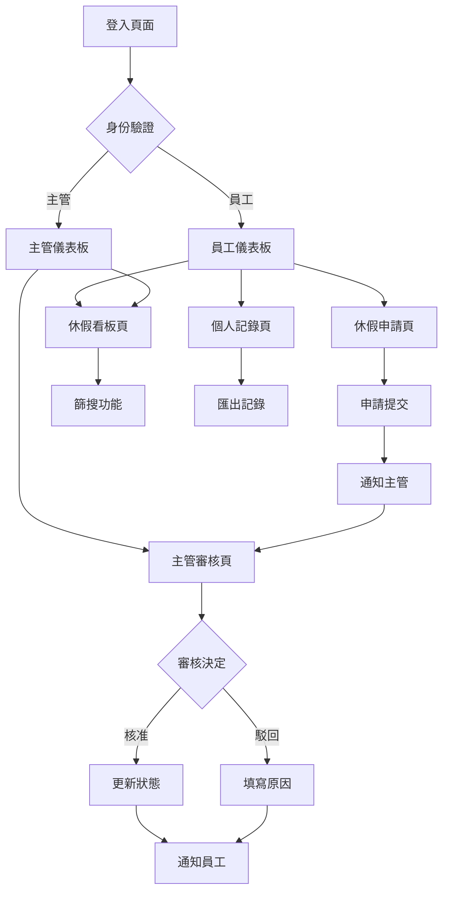

## 1. 產品概述
員工休假申請管理系統是一個企業內部使用的線上平台，讓員工能夠方便地申請休假，主管可以高效地審核申請，同時提供即時的休假狀態顯示。系統旨在簡化傳統的紙本申請流程，提高行政效率，確保休假管理的透明度和準確性。

## 2. 核心功能

### 2.1 使用者角色
| 角色 | 註冊方式 | 核心權限 |
|------|----------|----------|
| 一般員工 | 由管理員建立帳號 | 申請休假、查看個人休假記錄、查看團隊休假狀態 |
| 主管 | 由管理員設定為主管身份 | 審核下屬休假申請、查看團隊休假統計 |
| 管理員 | 系統初始帳號 | 管理使用者帳號、設定系統參數、查看所有報表 |

### 2.2 功能模組
系統包含以下主要頁面：
1. **員工儀表板**：個人休假統計、快速申請入口、待審核狀態
2. **休假申請頁**：日期選擇器、休假類型選擇、原因填寫、衝突檢查
3. **主管審核頁**：待審核清單、核准/駁回操作、審核歷史
4. **休假看板頁**：今日休假人員、部門休假總覽、篩選搜尋功能
5. **個人記錄頁**：個人休假歷史、剩餘休假天數、統計圖表

### 2.3 頁面詳細功能
| 頁面名稱 | 模組名稱 | 功能描述 |
|----------|----------|----------|
| 員工儀表板 | 個人統計卡片 | 顯示本年度已用休假天數、剩餘天數、本年申請次數 |
| 員工儀表板 | 快速申請區 | 提供單日/多日休假快速申請按鈕，跳轉至申請頁面 |
| 員工儀表板 | 申請狀態追蹤 | 顯示進行中的申請單狀態（待審核/已核准/已駁回） |
| 休假申請頁 | 日期選擇器 | 提供月曆介面，支援單日/連續多日選取，最多10天 |
| 休假申請頁 | 衝突檢查機制 | 即時檢查所選日期是否與已申請或國定假日衝突 |
| 休假申請頁 | 休假類型選擇 | 下拉選單包含特休、事假、病假、公假等選項 |
| 休假申請頁 | 申請原因輸入 | 文字輸入框，必填欄位，限制200字元內 |
| 休假申請頁 | 申請預覽 | 顯示申請總天數、日期範圍，供確認後提交 |
| 主管審核頁 | 待審核清單 | 表格顯示所有待審核申請，包含申請人、日期、類型、申請時間 |
| 主管審核頁 | 申請詳細檢視 | 點擊申請單顯示詳細資訊，包含原因說明、申請人資料 |
| 主管審核頁 | 審核操作區 | 提供核准/駁回按鈕，駁回時需填寫原因 |
| 主管審核頁 | 批次審核 | 支援多筆申請同時核准或駁回 |
| 休假看板頁 | 今日休假區 | 醒目顯示今日休假人員卡片，包含照片、部門、職稱 |
| 休假看板頁 | 部門篩選器 | 下拉選單篩選特定部門的休假資訊 |
| 休假看板頁 | 日期搜尋 | 日期選擇器查詢特定日期的休假安排 |
| 休假看板頁 | 關鍵字搜尋 | 輸入框支援員工姓名搜尋 |
| 個人記錄頁 | 休假歷史表 | 表格顯示個人所有休假記錄，包含申請日期、休假日期、狀態 |
| 個人記錄頁 | 統計圖表 | 圓餅圖顯示各類型休假使用比例 |
| 個人記錄頁 | 匯出功能 | 支援匯出個人休假記錄為PDF或Excel格式 |

## 3. 核心流程

### 員工申請流程
員工登入系統後，可在儀表板查看個人休假統計，點擊「申請休假」按鈕進入申請頁面。選擇休假日期（系統自動檢查衝突），選擇休假類型並填寫申請原因，預覽確認後提交申請。系統自動產生申請單號並發送通知給直屬主管。

### 主管審核流程
主管登入後進入審核頁面，查看待審核申請清單。可點擊單筆申請查看詳細資訊，選擇核准或駁回（駁回需填寫原因）。審核結果即時通知申請人，系統自動更新休假狀態。

### 查看休假狀態流程
所有使用者都可查看休假看板，預設顯示今日休假人員。可使用部門篩選、日期搜尋或姓名搜尋來查找特定休假資訊。系統即時更新已核准的休假資訊。

## 4. 使用者介面設計

### 4.1 設計風格
- **主要色彩**：藍色系（#1890ff）作為主色，象徵專業與信任；灰色（#f0f2f5）作為背景色
- **次要色彩**：綠色（#52c41a）表示成功/核准，紅色（#ff4d4f）表示錯誤/駁回，橘色（#faad14）表示警告/待審核
- **按鈕樣式**：圓角矩形設計，主要操作使用填滿樣式，次要操作使用邊框樣式
- **字體選擇**：系統預設字體，標題18-24px，內文14-16px，說明文字12px
- **佈局風格**：卡片式設計，每個功能區塊獨立呈現，留白適中提升閱讀性
- **圖示風格**：使用簡潔的線性圖示，保持視覺一致性

### 4.2 頁面設計概述
| 頁面名稱 | 模組名稱 | UI元素說明 |
|----------|----------|------------|
| 員工儀表板 | 統計卡片區 | 3-4個卡片水平排列，使用漸層背景，數字使用大號字體(32px)凸顯 |
| 員工儀表板 | 快速操作區 | 大按鈕設計，使用圖示+文字，懸停時有陰影效果 |
| 休假申請頁 | 日期選擇器 | 月曆介面，已選日期使用藍色背景，衝突日期顯示紅色並禁用 |
| 休假申請頁 | 表單區域 | 垂直表單佈局，每個欄位有清楚的標籤和說明文字 |
| 主管審核頁 | 申請清單 | 表格設計，隔行變色提升可讀性，狀態使用標籤顯示 |
| 休假看板頁 | 今日休假區 | 卡片瀑布流佈局，每張卡片包含員工頭像、姓名、部門資訊 |
| 休假看板頁 | 搜尋篩選區 | 置頂的搜尋欄，使用簡潔的輸入框和下拉選單 |

### 4.3 響應式設計
採用桌面優先設計，確保在1920x1080解析度下有最佳體驗。平板裝置（768px以上）保持主要功能完整，手機版（767px以下）採用單欄佈局，將複雜的表格轉換為卡片列表，確保觸控操作的便利性。

### 4.4 互動設計
- 載入狀態：使用骨架屏和進度條，提升等待體驗
- 表單驗證：即時驗證並顯示錯誤訊息，使用紅色框線和圖示提示
- 操作反饋：成功操作顯示綠色提示訊息，失敗操作顯示紅色警告
- 確認對話框：重要操作（如駁回申請）需要二次確認
- 鍵盤快捷鍵：支援Enter提交、Esc取消等常用快捷操作