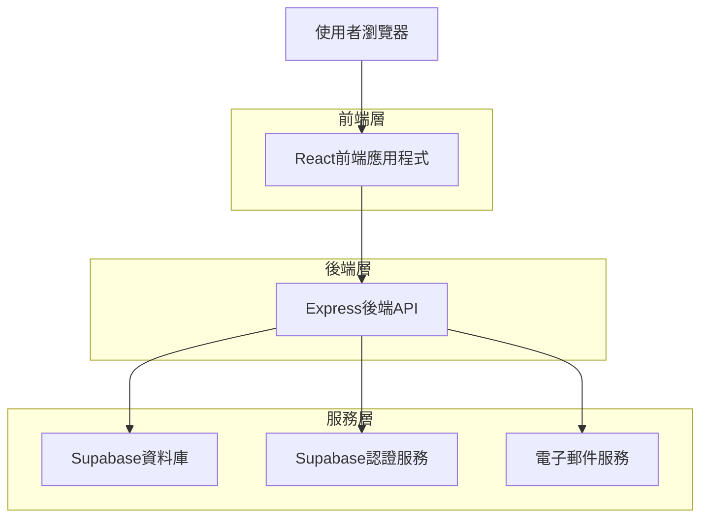
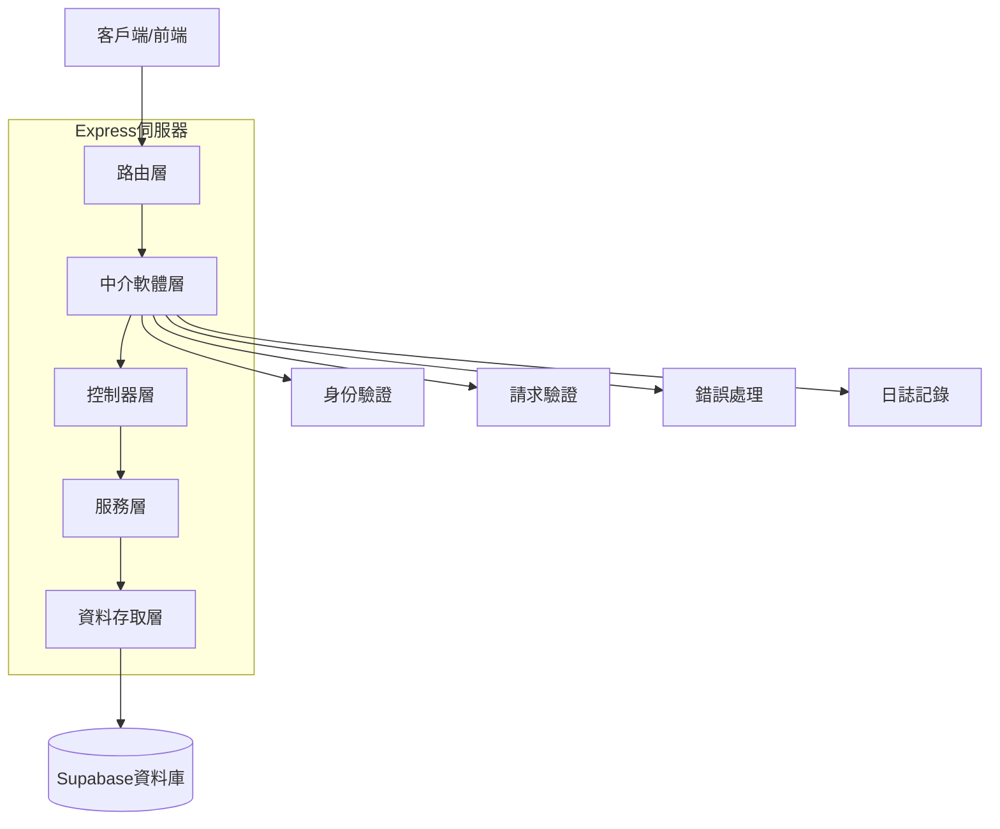
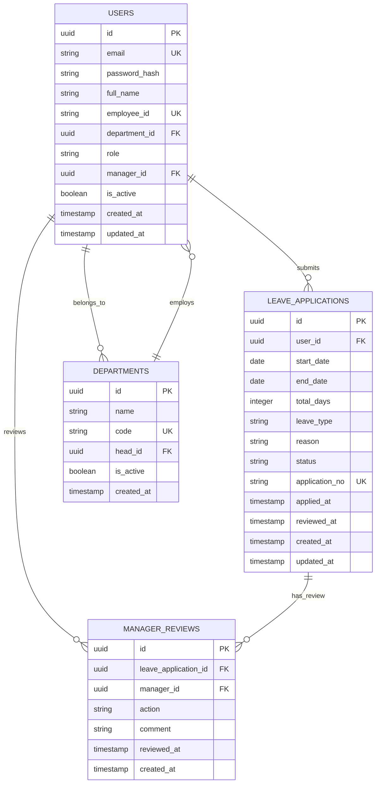

## 1. 架構設計



## 2. 技術描述

- **前端**: React@18 + TypeScript@5 + Vite@5 + Tailwind CSS@3
- **後端**: Express@4 + TypeScript@5 + Node.js@20
- **資料庫**: Supabase (PostgreSQL@15)
- **認證**: Supabase Auth
- **即時通訊**: Supabase Realtime
- **初始化工具**: vite-init
- **主要依賴**:
  - 前端: react-router-dom@6, @supabase/supabase-js@2, date-fns@3, react-hook-form@7, lucide-react@0.3
  - 後端: cors@2, helmet@7, express-rate-limit@7, jsonwebtoken@9, nodemailer@6

## 3. 路由定義

| 路由 | 用途 |
|-------|---------|
| / | 登入頁面，使用者身份驗證 |
| /dashboard | 儀表板首頁，根據角色顯示不同內容 |
| /leave/apply | 休假申請頁面，員工提交新休假申請 |
| /leave/status | 個人休假記錄頁面，查看歷史申請 |
| /manager/review | 主管審核頁面，審核下屬申請 |
| /board | 休假看板頁面，查看團隊休假狀態 |
| /profile | 個人檔案頁面，管理帳號設定 |

## 4. API定義

### 4.1 認證相關API

**登入**
```
POST /api/auth/login
```

請求:
| 參數名稱 | 參數類型 | 必填 | 描述 |
|-----------|-------------|-------------|-------------|
| email | string | true | 使用者電子郵件 |
| password | string | true | 密碼 |

回應:
| 參數名稱 | 參數類型 | 描述 |
|-----------|-------------|-------------|
| user | object | 使用者資訊 |
| token | string | JWT存取權杖 |
| refreshToken | string | 重新整理權杖 |

### 4.2 休假申請API

**提交休假申請**
```
POST /api/leaves
```

請求:
| 參數名稱 | 參數類型 | 必填 | 描述 |
|-----------|-------------|-------------|-------------|
| startDate | string | true | 開始日期 (YYYY-MM-DD) |
| endDate | string | true | 結束日期 (YYYY-MM-DD) |
| leaveType | string | true | 休假類型 (annual/sick/personal) |
| reason | string | true | 申請原因 |

**查詢個人休假記錄**
```
GET /api/leaves/my-leaves
```

查詢參數:
| 參數名稱 | 參數類型 | 描述 |
|-----------|-------------|-------------|
| status | string | 申請狀態篩選 |
| startDate | string | 開始日期篩選 |
| endDate | string | 結束日期篩選 |

### 4.3 主管審核API

**取得待審核申請**
```
GET /api/manager/pending-reviews
```

**審核休假申請**
```
PUT /api/manager/reviews/:leaveId
```

請求:
| 參數名稱 | 參數類型 | 必填 | 描述 |
|-----------|-------------|-------------|-------------|
| action | string | true | 審核動作 (approve/reject) |
| comment | string | false | 審核意見 (駁回時必填) |

### 4.4 休假看板API

**取得今日休假人員**
```
GET /api/board/today-leaves
```

**搜尋休假記錄**
```
GET /api/board/search
```

查詢參數:
| 參數名稱 | 參數類型 | 描述 |
|-----------|-------------|-------------|
| department | string | 部門篩選 |
| employeeName | string | 員工姓名搜尋 |
| date | string | 特定日期 |

## 5. 伺服器架構圖



## 6. 資料模型

### 6.1 資料模型定義



### 6.2 資料定義語言

**使用者表 (users)**
```sql
-- 建立使用者表
CREATE TABLE users (
    id UUID PRIMARY KEY DEFAULT gen_random_uuid(),
    email VARCHAR(255) UNIQUE NOT NULL,
    password_hash VARCHAR(255) NOT NULL,
    full_name VARCHAR(100) NOT NULL,
    employee_id VARCHAR(50) UNIQUE NOT NULL,
    department_id UUID REFERENCES departments(id),
    role VARCHAR(20) NOT NULL CHECK (role IN ('employee', 'manager', 'admin')),
    manager_id UUID REFERENCES users(id),
    is_active BOOLEAN DEFAULT true,
    created_at TIMESTAMP WITH TIME ZONE DEFAULT NOW(),
    updated_at TIMESTAMP WITH TIME ZONE DEFAULT NOW()
);

-- 建立索引
CREATE INDEX idx_users_department_id ON users(department_id);
CREATE INDEX idx_users_manager_id ON users(manager_id);
CREATE INDEX idx_users_role ON users(role);
CREATE INDEX idx_users_is_active ON users(is_active);
```

**休假申請表 (leave_applications)**
```sql
-- 建立休假申請表
CREATE TABLE leave_applications (
    id UUID PRIMARY KEY DEFAULT gen_random_uuid(),
    user_id UUID NOT NULL REFERENCES users(id),
    start_date DATE NOT NULL,
    end_date DATE NOT NULL,
    total_days INTEGER NOT NULL CHECK (total_days > 0 AND total_days <= 10),
    leave_type VARCHAR(20) NOT NULL CHECK (leave_type IN ('annual', 'sick', 'personal', 'official')),
    reason TEXT NOT NULL,
    status VARCHAR(20) NOT NULL DEFAULT 'pending' CHECK (status IN ('pending', 'approved', 'rejected')),
    application_no VARCHAR(20) UNIQUE NOT NULL,
    applied_at TIMESTAMP WITH TIME ZONE DEFAULT NOW(),
    reviewed_at TIMESTAMP WITH TIME ZONE,
    created_at TIMESTAMP WITH TIME ZONE DEFAULT NOW(),
    updated_at TIMESTAMP WITH TIME ZONE DEFAULT NOW()
);

-- 建立索引
CREATE INDEX idx_leave_applications_user_id ON leave_applications(user_id);
CREATE INDEX idx_leave_applications_status ON leave_applications(status);
CREATE INDEX idx_leave_applications_dates ON leave_applications(start_date, end_date);
CREATE INDEX idx_leave_applications_applied_at ON leave_applications(applied_at DESC);

-- 建立日期範圍索引（避免重複申請）
CREATE INDEX idx_leave_applications_date_range ON leave_applications(user_id, start_date, end_date) 
WHERE status IN ('pending', 'approved');
```

**主管審核表 (manager_reviews)**
```sql
-- 建立主管審核表
CREATE TABLE manager_reviews (
    id UUID PRIMARY KEY DEFAULT gen_random_uuid(),
    leave_application_id UUID NOT NULL REFERENCES leave_applications(id),
    manager_id UUID NOT NULL REFERENCES users(id),
    action VARCHAR(20) NOT NULL CHECK (action IN ('approved', 'rejected')),
    comment TEXT,
    reviewed_at TIMESTAMP WITH TIME ZONE DEFAULT NOW(),
    created_at TIMESTAMP WITH TIME ZONE DEFAULT NOW()
);

-- 建立索引
CREATE INDEX idx_manager_reviews_leave_application_id ON manager_reviews(leave_application_id);
CREATE INDEX idx_manager_reviews_manager_id ON manager_reviews(manager_id);
CREATE INDEX idx_manager_reviews_reviewed_at ON manager_reviews(reviewed_at DESC);
```

**部門表 (departments)**
```sql
-- 建立部門表
CREATE TABLE departments (
    id UUID PRIMARY KEY DEFAULT gen_random_uuid(),
    name VARCHAR(100) NOT NULL,
    code VARCHAR(20) UNIQUE NOT NULL,
    head_id UUID REFERENCES users(id),
    is_active BOOLEAN DEFAULT true,
    created_at TIMESTAMP WITH TIME ZONE DEFAULT NOW()
);

-- 建立索引
CREATE INDEX idx_departments_code ON departments(code);
CREATE INDEX idx_departments_is_active ON departments(is_active);
```

### 6.3 存取權限設定

```sql
-- 基本存取權限設定
GRANT SELECT ON users TO anon;
GRANT ALL PRIVILEGES ON users TO authenticated;

GRANT SELECT ON leave_applications TO anon;
GRANT ALL PRIVILEGES ON leave_applications TO authenticated;

GRANT SELECT ON manager_reviews TO anon;
GRANT ALL PRIVILEGES ON manager_reviews TO authenticated;

GRANT SELECT ON departments TO anon;
GRANT ALL PRIVILEGES ON departments TO authenticated;

-- RLS (Row Level Security) 政策
ALTER TABLE leave_applications ENABLE ROW LEVEL SECURITY;

-- 使用者只能查看自己的休假申請
CREATE POLICY "Users can view own leaves" ON leave_applications
    FOR SELECT USING (auth.uid() = user_id);

-- 使用者只能建立/更新自己的休假申請
CREATE POLICY "Users can manage own leaves" ON leave_applications
    FOR ALL USING (auth.uid() = user_id);

-- 主管可以查看部門內所有申請
CREATE POLICY "Managers can view department leaves" ON leave_applications
    FOR SELECT USING (
        EXISTS (
            SELECT 1 FROM users 
            WHERE users.id = auth.uid() 
            AND users.role = 'manager'
            AND users.department_id = leave_applications.user_id
        )
    );
```

### 6.4 初始資料

```sql
-- 插入測試部門
INSERT INTO departments (name, code) VALUES 
    ('人力資源部', 'HR'),
    ('工程部', 'ENG'),
    ('行銷部', 'MKT'),
    ('財務部', 'FIN');

-- 插入測試使用者（密碼需使用bcrypt加密）
INSERT INTO users (email, password_hash, full_name, employee_id, department_id, role) VALUES 
    ('admin@company.com', '$2b$10$...', '系統管理員', 'ADMIN001', (SELECT id FROM departments WHERE code = 'HR'), 'admin'),
    ('manager1@company.com', '$2b$10$...', '部門主管一', 'MGR001', (SELECT id FROM departments WHERE code = 'ENG'), 'manager'),
    ('employee1@company.com', '$2b$10$...', '測試員工一', 'EMP001', (SELECT id FROM departments WHERE code = 'ENG'), 'employee');
```